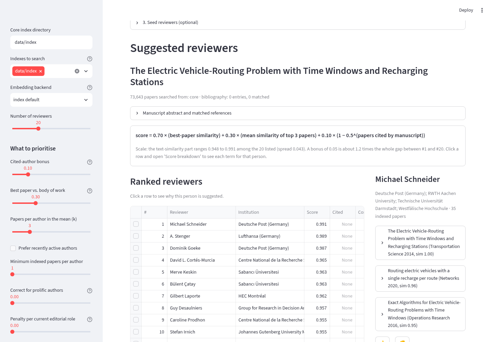
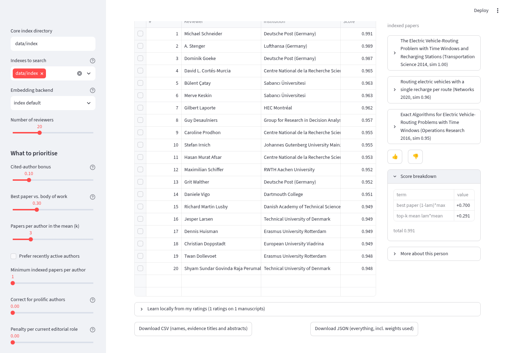

# orms-kindred

**Kindred** ranks candidate reviewers for an OR/MS manuscript from the authors of 74,000 recent papers in 29
operations research and management science journals. Give it a title and abstract (or a PDF); it returns a ranked list, the
papers behind each suggestion, and potential conflicts of interest with their evidence. Everything runs on your machine.



## Privacy

The index (titles, abstracts, authorships, references, embeddings of published papers; OpenAlex-derived, CC0) is public and
downloaded once. The manuscript is embedded and matched locally; no text, embedding or metadata about it leaves your machine.
`kindred verify-offline` runs a full query with network sockets disabled to prove it. Typing only the title and abstract means
the tool never handles the full manuscript at all.

## Install

Three downloads, nothing else:

| what | size | from |
|---|---|---|
| Python packages (torch, transformers, adapters, streamlit) | ~2.5 GB with CUDA, ~300 MB CPU-only | PyPI |
| the paper index | 165 MB | this repo's [Releases](https://github.com/angelamzhou/orms-kindred/releases) |
| the SPECTER2 embedding model, on first use | ~440 MB | Hugging Face |

```bash
git clone git@github.com:angelamzhou/orms-kindred.git && cd orms-kindred
python -m venv .venv && source .venv/bin/activate
pip install -e ".[embed,ui]"     # CPU-only: first  pip install torch --index-url https://download.pytorch.org/whl/cpu
kindred fetch-index              # core index -> data/ (sha256 verified)
kindred ui                       # opens http://localhost:8501
```

Python 3.10+. No GPU needed: one manuscript embeds in about 0.1 s on CPU. Optional add-on index: `kindred fetch-index --collection stats`.

## Use

1. **Manuscript**: type the title and abstract (paste the reference list too to enable the citation bonus), or upload the PDF.
2. **Authors and conflicts**: enter the manuscript's authors; their co-authors, colleagues and advisors are flagged, not hidden.
   Add people the data cannot know about to *My declared conflicts* (remembered between sessions).
3. **Seed reviewers** (optional): names you already have in mind pull the list toward similar people.

Click a row for the evidence: the papers that drove the match, with abstracts, and the conflict reason if any. The sidebar
weights (citation bonus, best-paper vs body-of-work, correction for prolific authors, seniority and editorial penalties,
early-career boost, diversity) re-rank instantly, and the page shows the scoring equation with the current values. Rate
candidates 👍/👎 and *Learn locally from my ratings* fits weights that match your judgement. Download the list as CSV or JSON.



Command line: `kindred suggest --title "..." --abstract "..." --author "Your Name" --n 20` or `kindred suggest paper.pdf`;
`kindred suggest --help` lists every weight. `kindred verify-offline paper.pdf` checks the no-network claim.

## How it works, in one paragraph

Each paper is embedded with SPECTER2 from its title and abstract; the manuscript is embedded the same way. An author's score
is a mix of the similarity of their closest paper and the mean of their top-k papers, plus a bonus if the manuscript cites
them, and optional penalties and corrections. Ranking authors by this score is the whole task. Leave-one-out on the index
(recovering a held-out paper's own authors among 100,000 candidates) gives MRR 0.32 and recall@20 0.39. Details, provenance
and evaluation: [`docs/kindred.pdf`](docs/kindred.pdf); maintenance, index building and publishing: [`docs/MAINTAINING.md`](docs/MAINTAINING.md);
the literature behind the design: [`docs/literature_review.md`](docs/literature_review.md).

## Acknowledgments

Thanks to Vishal Gupta for raising the idea, and to everyone at lunch and on the group chat for the discussions.

## Licence

Code: Apache-2.0. Index: derived from OpenAlex metadata (CC0) and Semantic Scholar abstracts. Model weights: SPECTER2 and
SciNCL are Apache-2.0.
